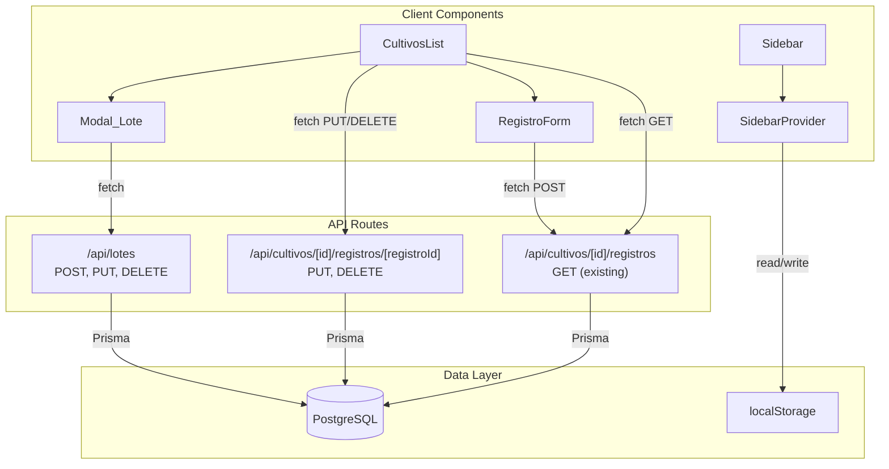

# Design Document: Cultivos Improvements

## Overview

Este diseño cubre cuatro mejoras interrelacionadas al módulo de Cultivos y al layout general de AgroTech:

1. **CRUD completo de Lotes** — API routes POST/PUT/DELETE en `/api/lotes`, componente Modal_Lote, actualización de estado local en CultivosList.
2. **Gestión de registros de actividad** — Endpoints PUT/DELETE en `/api/cultivos/[id]/registros/[registroId]`, botones de editar/eliminar en cada registro dentro de CultivosList.
3. **Actualización en tiempo real al crear registros** — Reemplazo de `window.location.reload()` con fetch dirigido y actualización de estado local.
4. **Sidebar colapsable en desktop** — Estado collapsed con persistencia en localStorage, transiciones CSS, ajuste de layout con flexbox.

Todas las mejoras siguen los patrones existentes del proyecto: Server Components para data fetching, Client Components para interactividad, API routes con autenticación/ownership checks, y Zod para validación.

## Architecture



### Decisiones de Diseño

1. **Estado local vs re-fetch completo**: Tras operaciones CRUD exitosas, se actualiza el estado local del componente en vez de recargar la página. Esto ofrece feedback inmediato al usuario. Para la creación de registros, se hace un re-fetch dirigido del endpoint GET de registros para garantizar consistencia con el servidor.

2. **Sidebar state en Context + localStorage**: El `SidebarProvider` ya existe para manejar el estado mobile. Se extiende con un nuevo campo `collapsed` que persiste en localStorage. El contexto se hidrata en el primer render del cliente.

3. **Zod en cliente y servidor**: Las mismas reglas de validación se definen una vez en `src/lib/validations.ts` y se usan tanto en el formulario (client-side) como en el API route (server-side). Esto evita divergencia.

4. **Confirmación de eliminación con nombre**: Para eliminar lotes (operación destructiva que puede afectar cultivos), se requiere escribir el nombre exacto del lote. Para registros (menos destructivo), basta un diálogo de confirmación simple.

## Components and Interfaces

### Nuevos Componentes

#### `Modal_Lote` (`src/components/cultivos/LoteForm.tsx`)

```typescript
interface LoteFormProps {
  fincaId: string;
  lote?: Lote | null;          // null = modo creación, Lote = modo edición
  onSuccess: (lote: Lote) => void;
  onCancel: () => void;
}
```

Formulario reutilizable para crear/editar lotes. Usa los componentes `Input`, `Textarea` de `@/components/ui`. Validación con `loteFormSchema` de Zod.

#### `DeleteLoteDialog` (inline en CultivosList)

Diálogo de confirmación que requiere escribir el nombre exacto del lote. Usa `Modal` + `Input` + `Button` de `@/components/ui`.

#### `DeleteRegistroDialog` (inline en CultivosList)

Diálogo de confirmación simple con botones Cancelar/Confirmar. Usa `Modal` + `Button`.

### Componentes Modificados

#### `CultivosList` (`src/components/cultivos/CultivosList.tsx`)

- Agregar estado local para lotes: `const [lotes, setLotes] = useState(finca.lotes)`
- Agregar botones de editar/eliminar en header de cada lote (íconos `Pencil`, `Trash2`)
- Agregar botones de editar/eliminar en cada registro de actividad
- Reemplazar `setRefreshKey` con fetch dirigido + actualización de estado
- Agregar botón "Agregar lote" en la parte superior

#### `Sidebar` (`src/components/layout/Sidebar.tsx`)

- Leer `collapsed` del contexto
- Condicionar ancho: `w-[220px]` vs `w-[68px]`
- Ocultar labels, finca info card cuando collapsed
- Agregar tooltips en los links cuando collapsed
- Agregar botón toggle (`PanelLeftClose`/`PanelLeftOpen`) encima de Configuración en footer

#### `SidebarProvider` (`src/components/providers/SidebarProvider.tsx`)

- Agregar `collapsed: boolean` y `toggleCollapsed: () => void` al contexto
- Hidratar desde `localStorage.getItem("sidebar-collapsed")` en mount
- Persistir a localStorage en cada cambio

#### Dashboard Layout (`src/app/(dashboard)/layout.tsx`)

- Leer `collapsed` del contexto
- Ajustar margen del contenido: `ml-[220px]` vs `ml-[68px]` con transición

### Nuevas API Routes

#### `POST /api/lotes` — Crear lote

```typescript
// Request body
{ nombre: string; areaHa: number; altitud?: number; pendiente?: number; notas?: string; fincaId: string }

// Response 201
{ data: Lote }

// Response 400
{ error: string }  // campos inválidos

// Response 401
{ error: "No autorizado" }
```

#### `PUT /api/lotes/[id]` — Actualizar lote

```typescript
// Request body
{ nombre?: string; areaHa?: number; altitud?: number; pendiente?: number; notas?: string }

// Response 200
{ data: Lote }

// Response 403
{ error: "No autorizado" }  // lote no pertenece al usuario
```

#### `DELETE /api/lotes/[id]` — Eliminar lote

```typescript
// Response 200
{ data: { message: "Lote eliminado" } }

// Response 409
{ error: "Existen cultivos activos en este lote..." }

// Response 403/401
{ error: "No autorizado" }
```

#### `PUT /api/cultivos/[id]/registros/[registroId]` — Actualizar registro

```typescript
// Request body
{ tipo?: TipoRegistro; descripcion?: string; fecha?: string }

// Response 200
{ data: RegistroCultivo }

// Response 404
{ error: "Registro no encontrado" }
```

#### `DELETE /api/cultivos/[id]/registros/[registroId]` — Eliminar registro

```typescript
// Response 200
{ data: { message: "Registro eliminado" } }

// Response 404
{ error: "Registro no encontrado" }

// Response 403
{ error: "No autorizado" }
```

## Data Models

No se requieren cambios al schema de Prisma. Los modelos existentes cubren todas las necesidades:

- **Lote**: `id`, `nombre`, `fincaId`, `areaHa`, `pendiente`, `altitud`, `notas`, `createdAt`, `updatedAt`
- **RegistroCultivo**: `id`, `cultivoId`, `tipo`, `descripcion`, `fecha`, `imagenes`, `datos`, `createdAt`
- **Relaciones de ownership**: `Lote → Finca → User` y `RegistroCultivo → Cultivo → Lote → Finca → User`

### Esquemas de Validación Nuevos (Zod)

```typescript
// src/lib/validations.ts — nuevo schema
export const loteFormSchema = z.object({
  nombre: z.string().min(1, "El nombre es requerido").max(100, "Máximo 100 caracteres"),
  areaHa: z.number({ invalid_type_error: "Debe ser un número" })
    .min(0.01, "Mínimo 0.01 ha")
    .max(10000, "Máximo 10000 ha"),
  altitud: z.number().min(0).max(5000).optional().nullable(),
  pendiente: z.number().min(0).max(90).optional().nullable(),
  notas: z.string().max(500, "Máximo 500 caracteres").optional().nullable(),
  fincaId: z.string().min(1, "La finca es requerida"),
});
```

### Estado del Sidebar (localStorage)

```
Key: "sidebar-collapsed"
Value: "true" | "false"
Default: "false" (expanded)
```

## Correctness Properties

*A property is a characteristic or behavior that should hold true across all valid executions of a system — essentially, a formal statement about what the system should do. Properties serve as the bridge between human-readable specifications and machine-verifiable correctness guarantees.*

### Property 1: Lote validation accepts valid data and rejects invalid data

*For any* lote payload where nombre has 1–100 characters, areaHa is between 0.01 and 10000, altitud (if present) is between 0 and 5000, and pendiente (if present) is between 0 and 90, the `loteFormSchema.safeParse` SHALL return success. *For any* payload where any field violates these constraints, the schema SHALL return failure with appropriate error messages.

**Validates: Requirements 1.2, 2.2**

### Property 2: Lotes with active cultivos cannot be deleted

*For any* lote that has at least one cultivo with `estado === "ACTIVO"`, the DELETE `/api/lotes/[id]` endpoint SHALL return status 409 and the lote SHALL remain in the database unchanged.

**Validates: Requirements 3.3**

### Property 3: Registro validation accepts valid data and rejects invalid data

*For any* registro payload where descripcion has 10–2000 characters, tipo is a valid TipoRegistro enum value, and fecha is not in the future, the `registroFormSchema.safeParse` SHALL return success. *For any* payload violating these constraints, the schema SHALL return failure.

**Validates: Requirements 4.2**

### Property 4: Registros are always displayed in descending date order

*For any* array of registros with distinct fechas, after the CultivosList state update, the rendered registros for each cultivo SHALL be sorted by fecha in descending order (most recent first).

**Validates: Requirements 6.2**

### Property 5: Sidebar state persistence round-trip

*For any* boolean value representing the sidebar collapsed state, writing it to localStorage under the key "sidebar-collapsed" and then reading it back on component mount SHALL produce the same collapsed/expanded state in the Sidebar component.

**Validates: Requirements 7.6, 7.7**

## Error Handling

### API Routes

| Escenario | Status | Mensaje |
|-----------|--------|---------|
| Sin sesión activa | 401 | "No autorizado" |
| Recurso no pertenece al usuario | 403 | "No autorizado" |
| Recurso no encontrado | 404 | "Registro no encontrado" / "Lote no encontrado" |
| Validación fallida | 400 | Mensajes específicos de Zod (campos inválidos) |
| Conflicto de negocio (cultivos activos) | 409 | "Existen cultivos activos en este lote. Finaliza o pausa los cultivos antes de eliminar." |
| Error interno del servidor | 500 | "Error interno" |

### Cliente (CultivosList)

- **Éxito en operaciones CRUD**: `toast.success(mensaje)` + actualización de estado local + cierre de modal
- **Error de red o servidor**: `toast.error(mensaje)` + modal permanece abierto con datos ingresados
- **Error al re-fetch de registros**: Mantener registros previos sin alteración + `toast.error("No se pudieron actualizar los registros")`
- **Validación client-side**: Mensajes de error inline en los campos del formulario via Zod, sin enviar request al servidor

### Sidebar

- **localStorage no disponible** (modo incógnito, SSR): Fallback a estado expandido (default). Usar try/catch al leer/escribir localStorage.

## Testing Strategy

### Enfoque Dual

Este feature se presta a una combinación de:
- **Property-based tests** para validación de datos (Zod schemas) y lógica de ordenamiento
- **Unit tests con ejemplos** para flujos de UI, feedback visual, y autenticación/autorización

### Librería de Property-Based Testing

**fast-check** (ya disponible en el ecosistema Node.js/TypeScript). Configuración: mínimo 100 iteraciones por property test.

### Property Tests (5 properties)

Cada test referencia su property del diseño:

1. **Lote validation** — Generar payloads aleatorios con fast-check (strings de longitud variable, números en rangos válidos/inválidos). Verificar que `loteFormSchema.safeParse` acepta los válidos y rechaza los inválidos.
   - Tag: `Feature: cultivos-improvements, Property 1: Lote validation accepts valid data and rejects invalid data`

2. **Delete protection** — Generar lotes con combinaciones de cultivos en diferentes estados (ACTIVO, PAUSADO, FINALIZADO). Verificar que la lógica de protección rechaza solo cuando hay al menos un ACTIVO.
   - Tag: `Feature: cultivos-improvements, Property 2: Lotes with active cultivos cannot be deleted`

3. **Registro validation** — Generar descripciones de longitud variable, tipos enum aleatorios, fechas pasadas/futuras. Verificar validación.
   - Tag: `Feature: cultivos-improvements, Property 3: Registro validation accepts valid data and rejects invalid data`

4. **Registros ordering** — Generar arrays de registros con fechas aleatorias, aplicar sort, verificar invariante de orden descendente.
   - Tag: `Feature: cultivos-improvements, Property 4: Registros are always displayed in descending date order`

5. **Sidebar persistence round-trip** — Generar secuencias aleatorias de toggle operations, verificar que localStorage siempre refleja el estado final correcto.
   - Tag: `Feature: cultivos-improvements, Property 5: Sidebar state persistence round-trip`

### Unit Tests (Examples)

- API routes: autenticación (401), autorización (403), happy paths
- UI: modals se abren/cierran correctamente, botones de acción visibles, toasts disparados
- Sidebar: tooltips en modo collapsed, botón toggle visible, labels ocultos

### Integration Tests

- Flujo completo crear lote → verificar en lista → editar → eliminar
- Flujo crear registro → re-fetch → verificar en lista ordenada
- Sidebar: colapsar → recargar → verificar estado restaurado
