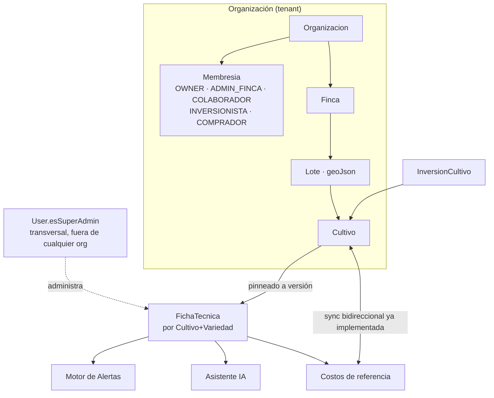

# CLAUDE.md — Contexto Maestro de AgroTech

> Este archivo es el contexto maestro para el desarrollo de AgroTech con asistentes de IA (Claude Code, Kiro). Complementa —no reemplaza— la documentación existente en `.kiro/steering/` (convenciones de código detalladas) y `.kiro/skills/` (personas de dominio especializadas). Cuando este archivo y `.kiro/steering/` entren en conflicto en temas de visión de producto o arquitectura objetivo, **este archivo tiene prioridad**; para convenciones de código línea a línea, `.kiro/steering/tech.md` y `structure.md` siguen siendo la fuente detallada.
>
> Especificación funcional exhaustiva: [`docs/REQUERIMIENTOS.md`](docs/REQUERIMIENTOS.md).

---

## 1. Visión y propósito

AgroTech es una PWA de gestión agrícola para Colombia. **Hoy** es una plataforma de finca única, usuario único, especializada solo en aguacate Hass, en producción con un piloto real (Finca El Juncal, Ocaña, Norte de Santander).

**El objetivo estratégico** es evolucionar hacia una plataforma **multi-finca, multi-rol y multi-cultivo**, soportando de forma nativa y parametrizable los tres cultivos priorizados de la región:

- **Aguacate** (Hass, Lorena, Papelillo, Choquette, Fuerte, Santana…)
- **Café** (Castillo, Caturra, Colombia, Típica, Borbón, Geisha, Cenicafé 1…)
- **Cacao** (CCN-51, ICS, TCS, FEAR 5, FSV 41, criollos regionales…)

...y extensible a nuevos cultivos/variedades **sin cambios de código**, a través de un Motor de Fichas Técnicas administrable. Cada cultivo tiene ciclo fenológico, requerimientos nutricionales, calendario agrícola, plagas, rangos ambientales óptimos y estructura de costos propios — el sistema no debe tratarlos como variaciones de un mismo formulario genérico.

**No perder de vista**: es un MVP real en producción con usuarios activos y presupuesto ajustado (~$12-15 USD/mes de infraestructura). Toda evolución hacia el objetivo debe preservar lo que ya funciona (ver §3) y avanzar en fases no disruptivas — no hay "big bang rewrite".

---

## 2. Arquitectura objetivo



### 2.1 Multi-tenancy: `Organizacion` como tenant explícito

Se introduce `Organizacion` por encima de `Finca` (no simplemente `User↔Finca N:M`), porque el negocio tiene casos que ese modelo simple no cubre: una cooperativa/asesor agrupa varias fincas de varios productores; un inversionista financia un **cultivo específico**, no la finca completa; un comprador no debe tener acceso "de membresía" salvo lo compartido explícitamente; el Super Admin opera transversal a todos los tenants.

- `Organizacion` — límite de tenant/facturación (plan: GRATUITO/PRODUCTOR/COOPERATIVA/ENTERPRISE).
- `Membresia` (User↔Organizacion): rol `OWNER | ADMIN_FINCA | COLABORADOR | INVERSIONISTA | COMPRADOR`.
- `FincaAcceso` (User↔Finca): scoping fino cuando una org tiene varias fincas y un miembro solo debe operar algunas.
- `User.esSuperAdmin: Boolean` — flag de plataforma, **no** modelado como rol dentro de una organización.
- **Migración no disruptiva**: backfill de 1 `Organizacion` por cada `User` existente (OWNER de su propia org), `Finca.organizacionId` poblado en el mismo script. Cero cambio de comportamiento visible para el piloto actual.

### 2.2 Motor de Fichas Técnicas (núcleo del sistema)

Es el componente más importante del rediseño: habilita multi-cultivo sin tocar código. **No se construye desde cero** — evoluciona el modelo `EspecieCultivo` que ya existe en `prisma/schema.prisma` (ya sembrado con Aguacate Hass, Café Caturra, Cacao CCN-51, Limón Tahití vía `prisma/seed-especies.ts`).

Jerarquía objetivo: `EspecieCultivo → Variedad → FichaTecnica (versionada) → {EtapaFenologica, ActividadCalendario, RequerimientoNutricional, PlanRiego, PlagaEnfermedad, CostoReferencia, PuntoCurvaProduccion}`.

Reglas clave:
- Una `FichaTecnica` tiene estado `BORRADOR | PUBLICADA | ARCHIVADA` y número de `version`.
- Un `Cultivo` se **pinea** a una versión concreta al crearse — republicar la ficha no altera retroactivamente cálculos/alertas de cultivos ya en curso; el usuario decide si "actualiza" a la última versión.
- Solo el Super Admin gestiona fichas maestras; los productores las consumen (seleccionan cultivo+variedad y la ficha se activa automáticamente).
- Las fichas alimentan: activación automática de calendario de actividades en Cultivos, costos de referencia y punto de equilibrio en Finanzas, umbrales de plagas/clima en Alertas, y contexto de razonamiento del Asistente IA.

Ver schema Prisma propuesto completo en [`docs/REQUERIMIENTOS.md` §4](docs/REQUERIMIENTOS.md#4-arquitectura-de-la-solución) y la ADR-002.

### 2.3 Roles y autorización

Cinco roles: **Productor/Dueño (OWNER)**, **Administrador de finca (ADMIN_FINCA)**, **Colaborador**, **Inversionista**, **Comprador**, más **Super Admin** de plataforma. Matriz completa rol×recurso×acción en `docs/REQUERIMIENTOS.md` §6.

**Hoy**: el enum `User.role` (`PRODUCER/ADVISOR/BUYER/ADMIN`) existe en el schema pero **no se usa para autorizar nada** — cada API route solo verifica `session.user.id` y filtra por ownership vía cadena de relaciones Prisma (`where: { finca: { userId } }`).

**Objetivo**: helper centralizado `src/lib/authz.ts` con `requireAccess(session, recurso, accion, ctx)` invocado al inicio de cada route handler, **más** el `where` de scoping como defensa en profundidad (uno decide *si puede*, el otro filtra *qué ve* — protege incluso si alguno de los dos se olvida). Ver ADR-004.

### 2.4 Aislamiento de datos

**Decisión**: no usar RLS nativo de Postgres en esta fase (Neon + Prisma con connection pooling hace frágil `SET LOCAL` por request; alto costo de desarrollo/testing para el tamaño de equipo actual). En su lugar: patrón de **repositorio scoped obligatorio** (`scopedDb(session)` en `src/lib/db/scoped.ts`), regla de CI que impida `prisma.<modelo tenant-scoped>` directo fuera de esa capa, y tests de aislamiento cross-tenant con Vitest. Ver ADR-005 para criterio de revisión futura.

### 2.5 Inversionistas (diferenciador de mercado)

`InversionCultivo` (aporte a un **cultivo específico**, no a la finca completa — coherente con que `Gasto`/`Ingreso` ya son opcionalmente `cultivoId`-scoped) + `RetornoInversion`. KPIs (rentabilidad, % participación) se calculan en `src/lib/finance/investor-kpis.ts`, no se almacenan. Un inversionista puede financiar el lote de cacao sin tener visibilidad del lote de café de la misma finca (scoping por `InversionCultivo.cultivoId`, no por finca).

---

## 3. Stack tecnológico: actual vs. objetivo

| Capa | Actual (verificado en código) | Objetivo / nota |
|---|---|---|
| Framework | Next.js 15.3.6 (App Router), React 19, TS 5 strict | Se mantiene — no hay razón para migrar |
| Datos | PostgreSQL 16 + Prisma 6, Neon serverless en prod | Se mantiene; ver §2.4 sobre RLS |
| Auth | NextAuth 4.24.11, `CredentialsProvider` (bcryptjs), JWT | Se mantiene NextAuth; se añade `Organizacion`/`Membresia`/`authz.ts` |
| Roles | `UserRole` enum sin uso real de autorización | RBAC real vía `authz.ts` (§2.3) |
| IA conversacional | **Groq** (`llama-3.1-8b-instant`) — no Anthropic. `.env.example`/README mencionan `ANTHROPIC_API_KEY` pero el código real (`src/app/api/chat/route.ts`) usa `GROQ_API_KEY`, no documentada en `.env.example` | Prioridad crítica inmediata: sumar diagnóstico por imagen y entrada por voz (§4 y RF14-RF15). Evaluar modelo con soporte de visión nativo |
| RAG | Knowledge base hardcodeada de solo aguacate (`src/lib/knowledge/base.ts`) | Migrar a consultar `FichaTecnica`/`PlagaEnfermedad` dinámicamente — RAG multi-cultivo real, no texto fijo |
| Clima | OpenWeatherMap real; IDEAM solo mencionado, sin integración de código | Evaluar integración real de datos abiertos IDEAM como fuente complementaria |
| Mapas | Leaflet + react-leaflet + leaflet-draw, sin API key | Se mantiene |
| Fichas técnicas | `EspecieCultivo` embrionario (Json de etapas/tipos de registro, sembrado con 4 especies) | Motor completo versionado (§2.2) |
| PWA / offline | Manifest e íconos completos, pero **service worker deshabilitado** (`disable: true` en `next.config.ts`) tras varios intentos fallidos; solo hay detección online/offline (`OfflineBanner.tsx`), sin sync real | Reactivar offline-first real es Fase 6 (hardening), no prioridad inmediata |
| Deploy | Vercel + Neon (confirmado por commits y skills doc) | `railway.toml` presente en el repo es **vestigial** del intento inicial — no se usa; no borrar sin confirmar, pero no tratarlo como fuente de verdad de deployment |
| Tests | Vitest 4 + Testing Library + fast-check (property-based). Sin script `test` en `package.json` (correr con `npx vitest`). Sin E2E | Añadir `"test": "vitest"` a scripts; considerar Playwright para flujos críticos multi-rol |
| CI/CD | No existe `.github/workflows/` | Pendiente — ver Fase 6 en roadmap |

---

## 4. Reglas de negocio críticas por cultivo

El motor de fichas técnicas (§2.2) es lo que hace estas reglas **datos, no código**. Aun así, el razonamiento agronómico debe ser explícitamente diferenciado — nunca tratar café/cacao como "aguacate con otro nombre":

- **Aguacate Hass**: ciclo largo (3-4 años a primera cosecha productiva relevante), fertilización y riego por etapa fenológica (PREPARACION→SIEMBRA→ESTABLECIMIENTO→CRECIMIENTO→PRODUCCION→COSECHA, enum `EtapaCultivo` ya existente), altitud óptima 1.500-2.200 msnm, plagas típicas (trips, ácaros, antracnosis), venta por calidad/calibre a cooperativas/exportadores.
- **Café**: ciclo fenológico y calendario de fertilización/poda/cosecha totalmente distinto (floración, llenado de grano, cereza madura), precio referenciado a bolsa (FNC), comercialización vía cooperativas cafeteras, certificaciones propias (FNC, Rainforest, orgánico).
- **Cacao**: ciclo de fermentación/secado post-cosecha propio (no aplica a aguacate/café), precio referenciado a mercado internacional (ICCO), comercialización vía comercializadoras/FEDECACAO, sombra/sistemas agroforestales como práctica típica.

**Regla de implementación**: ningún formulario, cálculo financiero, alerta o prompt de IA debe asumir "aguacate" por defecto una vez el motor de fichas técnicas esté activo — todo debe leer de `FichaTecnica` según `Cultivo.variedadId`. Hoy (`Cultivo.especie`/`variedad` como strings libres con default `"Aguacate"`/`"Hass"`) es deuda técnica reconocida, no el diseño final.

---

## 5. Convenciones de código

Documentadas en detalle en `.kiro/steering/tech.md` (stack, paleta de colores, componentes UI obligatorios) y `.kiro/steering/structure.md` (árbol de directorios, convenciones de nombres, patrón de imports). Resumen de lo no-negociable:

- **Nunca crear botones/inputs/modals desde cero** — usar `src/components/ui/index.tsx` (`Button`, `Input`, `Select`, `Textarea`, `Modal`, `EmptyState`) y `Skeleton.tsx`. No es shadcn/ui, es un design system propio.
- Patrón de API route (App Router, Next 15 → `params` es `Promise<{...}>`):
  ```ts
  export async function POST(req: Request, { params }: { params: Promise<{ id: string }> }) {
    try {
      const session = await getServerSession(authOptions);
      if (!session?.user?.id) return NextResponse.json({ error: "No autorizado" }, { status: 401 });
      // TODO (objetivo): await requireAccess(session, recurso, accion, ctx) — ver §2.3
      // ... lógica con scoping por relación (finca.userId) o scopedDb() cuando exista
    } catch (error) {
      console.error("[POST /api/...]", error);
      return NextResponse.json({ error: "Error interno" }, { status: 500 });
    }
  }
  ```
- Validación con Zod (`src/lib/validations.ts`), server-side siempre, client-side como UX adicional.
- Formularios: `useState` + `safeParse` + `react-hot-toast`, sin capa de API client centralizada (no hay React Query/SWR/Zustand — es deliberado, no agregar sin justificar).
- Formato de moneda/fecha: `src/lib/utils.ts` (`formatCOP`, `formatDate`) — nunca formatear inline.
- Labels de enums centralizados en `src/types/index.ts` (`ETAPA_LABELS`, `CATEGORIA_LABELS`, etc.) — al añadir un enum nuevo, añadir su tabla de labels ahí.
- **No romper el patrón de sincronización bidireccional Cultivos↔Finanzas** (`src/app/api/cultivos/[id]/registros/route.ts` ↔ `src/app/api/gastos/route.ts`/`ingresos/route.ts`) al tocar esos módulos — es un diferenciador de producto ya funcionando en producción.
- **Paridad modo simple/modo completo**: toda función nueva agregada a modo completo debe clasificarse en [`docs/paridad-modo-simple.md`](docs/paridad-modo-simple.md) — paridad completa, exclusión con salida (reutilizando `SalidaModoCompleto`, ver `src/components/shared/SalidaModoCompleto.tsx`), o pendiente de decidir — antes de darse por terminada. No dejar una función nueva sin clasificar en esa tabla.

---

## 6. Guía de desarrollo con IA (Kiro / Claude Code)

El repositorio ya tiene 33 "skills" de dominio en `.kiro/skills/*/agrotech-*/SKILL.md`, organizados en 8 categorías (strategy, architecture, domain, development, ai-data, product, operations, commerce). Úsalos como personas especializadas según la tarea:

- Diseño de arquitectura/schema → `agrotech-arquitecto-software`, `agrotech-cto`.
- Reglas agronómicas por cultivo → `agrotech-agronomo` (rigor técnico) + `agrotech-agricultor-colombiano` (validación práctica de campo).
- Finanzas/inversionistas/costos → `agrotech-admin-agropecuario`.
- Seguridad/Ley 1581/multi-tenant → `agrotech-ciberseguridad`.
- RAG/visión/voz → `agrotech-ia-especialista`.
- UX rural (baja alfabetización digital, conectividad limitada) → `agrotech-ux-ui`.

**Antes de proponer un modelo de datos nuevo**, revisar si `EspecieCultivo`, `RegistroCultivo` (con su sync bidireccional) o `AlertaClimatica`/`alert-engine.ts` ya cubren el caso — este proyecto premia extender lo existente sobre reescribir.

**Nota de discrepancias detectadas** (para no propagarlas): las specs en `.kiro/specs/` (`lotes-bidirectional-management`, `sprint3`, `cultivos-improvements`) no cubren los sprints 4-6 ya implementados (multicultivo paramétrico, jornales, reportes FINAGRO, módulo de finanzas actual) — no asumir que `.kiro/specs/` refleja el 100% del código real; confirmar contra el schema y las API routes.

---

## 7. Estándares de seguridad y calidad

- **OWASP Top 10**: autorización real (§2.3) es el gap más crítico hoy — priorizar antes de exponer roles Inversionista/Comprador con datos financieros sensibles.
- **Ley 1581 de 2012 (Colombia, protección de datos personales)**: aplica a datos de productores, inversionistas (información financiera) y compradores (contacto comercial). Requiere: consentimiento informado en registro, política de tratamiento de datos publicada, y capacidad de exportar/eliminar datos del usuario a solicitud.
- **Multi-tenant**: ningún query a modelos tenant-scoped sin filtro de organización/finca (ver `scopedDb`, §2.4). Tests de aislamiento cross-tenant obligatorios antes de habilitar Inversionista/Comprador en producción.
- **Secretos**: `GROQ_API_KEY` no está en `.env.example` pese a usarse en producción — corregir esa inconsistencia es una tarea de higiene inmediata, no arquitectónica.
- **Calidad**: mantener cobertura de tests de propiedades (`fast-check`) al tocar validaciones de GeoJSON/formularios — patrón ya establecido en `src/__tests__/properties/`.

---

## 8. Referencias

- Especificación funcional completa (20 RF, no funcionales, seguridad, ADRs, gap analysis, roadmap): [`docs/REQUERIMIENTOS.md`](docs/REQUERIMIENTOS.md)
- Convenciones de código detalladas: `.kiro/steering/tech.md`, `.kiro/steering/structure.md`
- Dominio de aguacate (estado actual): `.kiro/steering/agrotech-domain.md`
- Visión de producto y modelo de negocio: `.kiro/steering/product.md`
- Skills de dominio: `.kiro/skills/`
