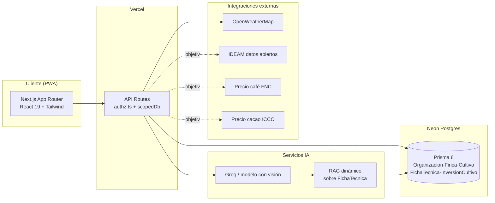
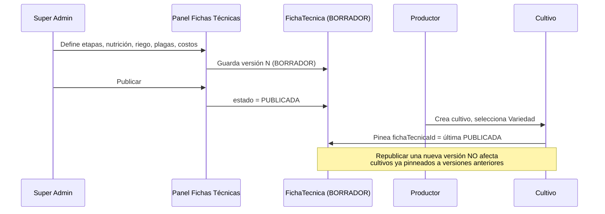
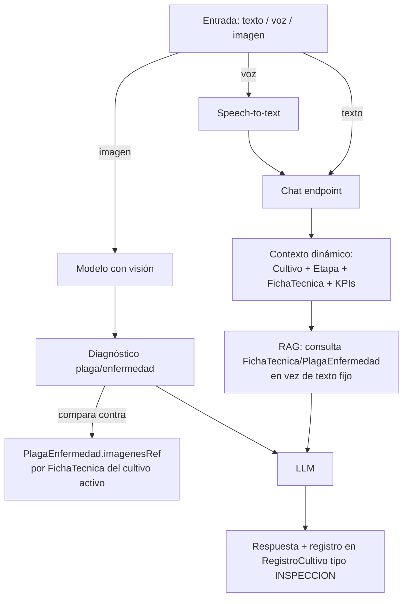
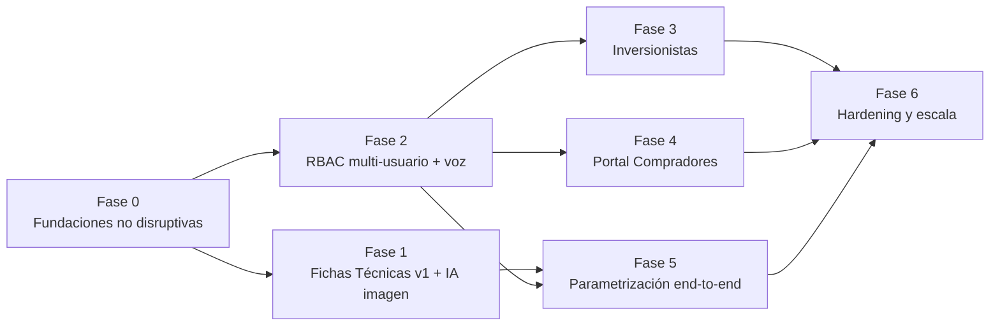

# AgroTech — Especificación de Requerimientos

**Versión**: 1.0 · **Fecha**: 2026-08-08 · **Alcance**: evolución de plataforma mono-finca/mono-usuario/mono-cultivo (aguacate Hass) hacia plataforma multi-finca, multi-rol, multi-cultivo (aguacate, café, cacao, extensible) con IA avanzada.

> Contexto maestro de arquitectura y convenciones: [`CLAUDE.md`](../CLAUDE.md). Este documento es la especificación funcional/no funcional exhaustiva que la alimenta.

**Nota metodológica**: cada requerimiento se contrasta contra el estado real del código (verificado por exploración directa del repositorio, no asumido), marcado como 🟢 *implementado*, 🟡 *parcial*, o 🔴 *no existe*.

---

## Índice

1. [Requerimientos Funcionales](#1-requerimientos-funcionales)
2. [Requerimientos No Funcionales](#2-requerimientos-no-funcionales)
3. [Requerimientos de Seguridad](#3-requerimientos-de-seguridad)
4. [Arquitectura de la Solución](#4-arquitectura-de-la-solución)
5. [Escalabilidad y Rendimiento](#5-escalabilidad-y-rendimiento)
6. [Gestión de Roles y Permisos](#6-gestión-de-roles-y-permisos)
7. [Decisiones Arquitectónicas (ADRs)](#7-decisiones-arquitectónicas-adrs)
8. [Análisis de Brechas (Gap Analysis)](#8-análisis-de-brechas-gap-analysis)
9. [Roadmap de Implementación](#9-roadmap-de-implementación)

---

## 1. Requerimientos Funcionales

### 1.1 Módulo Cultivos

#### RF1 — Registro de finca 🟡 parcial
El usuario debe registrar al menos una finca (nombre, municipio, departamento, altitud, coordenadas, área total) antes de operar cualquier otro módulo.
- **Estado actual**: modelo `Finca` existe y funciona; el código asume una sola finca activa por usuario (`db.finca.findFirst({where:{userId}})` en varios lugares) aunque el schema soporta `User 1:N Finca`.
- **Criterios de aceptación**:
  1. No se puede crear un `Lote` sin una `Finca` existente.
  2. El formulario valida municipio/departamento contra una lista de Colombia (evitar texto libre para reportes agregados futuros).
  3. **Objetivo multi-finca**: el usuario puede tener y alternar entre varias fincas activas (selector de finca en el header/sidebar) sin perder el contexto de la finca seleccionada entre navegaciones.

#### RF2 — Creación del polígono del lote 🟢 implementado
El productor dibuja el área georreferenciada de cada lote sobre un mapa interactivo.
- **Estado actual**: funcional end-to-end — `Lote.geoJson` (Json), validación estricta de GeoJSON Polygon en `src/lib/validations.ts` (anillo cerrado, mín. 4 posiciones, máx. 100 coordenadas, rangos lat/lng válidos), dibujo con Leaflet Draw (`src/components/mapa/`), cálculo geodésico de área/centroide propio (`src/lib/geo.ts`).
- **Criterios de aceptación**:
  1. Un lote puede crearse sin geometría y completarse después (flujo actual: "Dibujar área en el mapa" → redirige a `/dashboard/mapa?action=draw&loteId=...`).
  2. El área calculada del polígono se compara contra `Lote.areaHa` declarada y se advierte si difiere significativamente.
  3. Un lote no puede eliminarse si tiene cultivos activos asociados (regla de protección ya cubierta por tests de propiedades en `src/__tests__/properties/lote-delete-protection.property.test.ts`).

#### RF3 — Análisis preliminar opcional 🔴 no existe
Georreferenciación avanzada, clima histórico, altitud, estudio de suelos y humedad como paso opcional antes de sembrar.
- **Estado actual**: solo existen `Lote.altitud` y `Lote.pendiente` como campos sueltos; no hay análisis de suelo (pH, textura, materia orgánica) ni consulta de clima histórico por ubicación.
- **Criterios de aceptación**:
  1. El sistema sugiere aptitud del lote para un cultivo/variedad comparando `Lote.altitud`/coordenadas contra los rangos óptimos de la `FichaTecnica` candidata (§4.2), sin bloquear la siembra si no es óptimo — solo advertir.
  2. Registro opcional de análisis de suelo (pH, textura, materia orgánica, fecha de muestreo) asociado al lote, consultable desde Cultivos y usado como contexto por el Asistente IA.

#### RF4 — Registro de actividades para seguimiento 🟢 implementado
Bitácora de campo (cuaderno de campo digital) por cultivo.
- **Estado actual**: `RegistroCultivo` (tipo, descripción, fecha, imágenes, datos Json), formulario con plantillas rápidas por tipo (`RegistroForm.tsx`), integrado con evidencia fotográfica en Jornales (`PhotoCapture.tsx`) con badge "BPA-ICA" para trazabilidad.
- **Criterios de aceptación**:
  1. Cada registro permite adjuntar 1+ imágenes (campo `imagenes String[]` ya existe en schema — hoy sin uso real desde el formulario de registro, solo desde Jornales; unificar).
  2. Tipos de registro válidos dependen de la `FichaTecnica` activa del cultivo (objetivo) — hoy es un enum fijo `TipoRegistro` (SIEMBRA, RIEGO, FERTILIZACION, PODA, TRATAMIENTO_PLAGAS, COSECHA, OBSERVACION, INSPECCION, ALERTA) igual para todos los cultivos.
  3. Un registro de tipo FERTILIZACION/TRATAMIENTO_PLAGAS/RIEGO/PODA con costo asociado crea automáticamente un `Gasto` vinculado (ya implementado, ver RF8); uno de tipo COSECHA con ingreso crea un `Ingreso` vinculado.

#### RF5 — Activación automática de ficha técnica por cultivo y variedad 🟡 parcial (embrionario)
Al crear un cultivo, seleccionar especie+variedad activa automáticamente su ficha técnica (calendario, requerimientos, umbrales de alerta).
- **Estado actual**: existe `EspecieCultivo` (catálogo paramétrico sembrado con Aguacate Hass, Café Caturra, Cacao CCN-51, Limón Tahití — `prisma/seed-especies.ts`), vinculable a `Cultivo` vía `especieId` (migración gradual, endpoint `POST /api/cultivos/vincular-especie`). Hoy `Cultivo.especie`/`variedad` son strings libres con default `"Aguacate"`/`"Hass"` — la vinculación a `EspecieCultivo` es opcional y no se fuerza en el flujo de creación.
- **Criterios de aceptación**:
  1. El formulario de creación de cultivo obliga a seleccionar especie+variedad de un catálogo (no texto libre), resolviendo a una `FichaTecnica` publicada.
  2. Al seleccionar cultivo/variedad, se pre-cargan: etapas fenológicas esperadas, calendario de actividades sugerido, y umbrales de alerta — sin bloquear edición manual.
  3. El `Cultivo` queda pinneado a la versión de `FichaTecnica` vigente al momento de creación (ver ADR-002); actualizar a una versión más nueva es una acción explícita del usuario, no automática.

### 1.2 Módulo Finanzas

#### RF6 — Precondición del módulo 🟢 implementado
Requiere `Finca` (RF1) y al menos un `Cultivo` creado antes de operar.
- **Criterios de aceptación**: las páginas de Finanzas muestran `EmptyState` guiando al usuario a crear cultivo si no existe ninguno, en vez de mostrar tablas vacías sin contexto.

#### RF7 — Dashboard de resumen 🟢 implementado
- **Estado actual**: `src/app/(dashboard)/dashboard/finanzas/page.tsx` agrega 7 queries en paralelo (gastos, ingresos, cultivos, compradores, finca, lotes, presupuestos del año) → `FinanzasClient.tsx` (1013 líneas, con tabs). Widgets de dashboard general: `KpiCards.tsx`, `FinancialChart.tsx` (ya corregido para usar datos reales, no hardcodeados — commit `1e27c200`).
- **Criterios de aceptación**: el resumen incluye, como mínimo, saldo (ingresos−gastos), costo/ha, costo/planta, punto de equilibrio, margen bruto proyectado, y — objetivo — desglose por cultivo cuando la finca tiene más de uno activo (hoy el resumen es agregado a nivel finca, no siempre desagregado por cultivo).

#### RF8 — Registro y gestión integral de Costos 🟢 implementado
- **Estado actual**: `Gasto` (categoria: INSUMOS/MANO_OBRA/MAQUINARIA/AGUA_RIEGO/TRANSPORTE/CERTIFICACIONES/TIERRA/SEMILLAS_PLANTULAS/HERRAMIENTAS/ENERGIA/OTROS; tipoGasto: FIJO/VARIABLE/INVERSION; auto-cálculo monto=cantidad×precioUnitario). Tab "Costos" con distribución por tipo, costo por lote, top 5 gastos.
- **Objetivo**: proyección de costos según cultivo/variedad usando `CostoReferencia` de la `FichaTecnica` (comparar gasto real vs. referencia esperada por etapa).

#### RF9 — Presupuesto por categorías 🟢 implementado
- **Estado actual**: `Presupuesto` (único por `fincaId+anio+categoria`), tab con formulario por categoría y tabla presupuesto vs. ejecución con semáforo 🟢🟡🔴.

#### RF10 — Registro y gestión integral de Ingresos 🟢 implementado
- **Estado actual**: `Ingreso` (concepto, monto, cantidadKg, precioKg auto-calculado, `cultivoId?`, `compradorId?`).

#### RF11 — Registro y gestión integral de Gastos 🟢 implementado
Cubierto junto con RF8 — mismo modelo `Gasto`.

#### RF12 — PyG (Pérdidas y Ganancias) 🟡 parcial
- **Estado actual**: no existe un módulo "PyG" formal separado; el saldo simple (ingresos−gastos) del resumen financiero cumple ese rol de forma simplificada. Sí existe exportación a PDF genérica (`src/lib/pdf-export.ts`) y un reporte específico FINAGRO (`src/app/api/reportes/finagro/route.ts`, `ExportarFinagroButton.tsx`) para trámites de crédito agropecuario.
- **Criterios de aceptación (objetivo)**:
  1. Estado de resultados por cultivo y por finca, por rango de fechas, con categorías estándar (ingresos operativos, costos directos, costos indirectos, utilidad bruta, utilidad neta).
  2. Cuando el cultivo tiene `InversionCultivo` asociadas, el PyG muestra utilidad neta distribuible según `porcentajeParticipacion` (ver §1.2 RF-Inversionistas más abajo y ADR-003).
  3. Reporte FINAGRO existente se extiende para incluir sección de inversionistas — no se reemplaza, se amplía.

**Reglas de negocio financieras diferenciadas por cultivo** (objetivo, alimentadas por `FichaTecnica`):
- Costo promedio por planta difiere estructuralmente: aguacate (ciclo largo, alta inversión inicial en material vegetal), café (ciclo de recolección manual intensivo, jornales dominantes), cacao (costo de fermentación/secado post-cosecha propio, no aplica a los otros dos).
- Punto de equilibrio (precio mínimo para no ir a pérdidas) debe usar `PuntoCurvaProduccion` específico de la ficha técnica, no un supuesto fijo de "8000 kg/ha" (valor hoy hardcodeado en el cálculo de proyección de `FinanzasClient.tsx` — deuda técnica a resolver junto con el motor de fichas).
- Comportamiento de precios de venta: café referenciado a precio de bolsa (FNC), cacao a precio internacional (ICCO), aguacate por calidad/calibre negociado directamente con comprador — requiere fuente de precio distinta por cultivo (§4.6).

**RF-Inversionistas** (crítico, mencionado explícitamente como diferenciador) 🔴 no existe:
- Un inversionista aporta capital a uno o más cultivos específicos (no a toda la finca) vía `InversionCultivo` (monto, fecha, `porcentajeParticipacion`, condiciones).
- Un inversionista solo ve los cultivos que financia (scoping por `InversionCultivo.cultivoId`, rol `INVERSIONISTA` en `Membresia`) — nunca el resto de la finca.
- KPIs por inversionista: rentabilidad (`(Σ retornos − monto aportado) / monto aportado`), % de participación, cobertura de financiamiento externo vs. capital propio del productor por cultivo.

### 1.3 Módulo Asistente IA

#### RF13 — Preguntas predeterminadas 🟡 parcial
- **Estado actual**: el chat (`ChatInterface.tsx`) es de texto libre; no se encontró un set curado de preguntas predeterminadas/sugeridas en la UI actual.
- **Criterio de aceptación**: mostrar 4-6 preguntas sugeridas contextuales según etapa del cultivo activo (ej. en etapa PRODUCCION: "¿cuándo debo fertilizar?", "¿qué plagas son comunes ahora?").

#### RF14 — Preguntas por voz y/o escritas 🟡 parcial (solo escritas)
- **Estado actual**: solo texto. `src/app/api/chat/route.ts` llama a Groq (`llama-3.1-8b-instant`) con prompt de sistema dual (rol agronómico + asesor financiero FINAGRO/Banco Agrario), contexto dinámico inyectado desde `src/app/api/chat/context/route.ts` (finca, cultivos, KPIs). No se encontró entrada ni salida de voz (grep sin resultados en `ChatInterface.tsx`).
- **Criterios de aceptación (objetivo)**:
  1. Entrada de voz: transcripción (speech-to-text) del audio grabado en el dispositivo del usuario a texto, reutilizando el mismo endpoint de chat.
  2. Prioridad: transcripción de bitácora de campo por voz (RF4) es tan o más valiosa que voz en el chat conversacional para el contexto rural (manos ocupadas en campo).
  3. Debe funcionar en español colombiano con acentos/dialectos regionales — no asumir inglés como fallback silencioso.

#### RF15 — Diagnóstico por imagen 🔴 no existe (prioridad crítica de negocio)
- **Estado actual**: existe `PhotoCapture.tsx` como componente genérico de captura de foto, usado solo para evidencia fotográfica de jornales (BPA-ICA) — no hay análisis de imagen vía IA en ningún endpoint.
- **Criterios de aceptación**:
  1. El usuario sube o captura una foto de una hoja/fruto/tallo afectado; el sistema identifica plaga/enfermedad probable con nivel de confianza y recomienda manejo.
  2. El diagnóstico es **específico al cultivo** del contexto activo (`Cultivo.variedadId` → `FichaTecnica.plagas`) — nunca un catálogo genérico que mezcle plagas de aguacate con las de café/cacao.
  3. `PlagaEnfermedad.imagenesRef` (catálogo de referencia por ficha técnica, §4.2) se usa como base de comparación/pocos-shots inicial, poblado primero para aguacate (cultivo con más datos hoy) y ampliado a café/cacao en paralelo al motor de fichas.
  4. El diagnóstico queda registrado como `RegistroCultivo` tipo INSPECCION con la imagen y el resultado, alimentando el histórico de bitácora.

**Reglas de razonamiento diferenciado por cultivo** (aplica a RF13-15): el asistente debe responder con precisión de un profesional (agrónomo/ingeniero ambiental) **específico** al cultivo consultado — nunca conocimiento genérico. Hoy el RAG (`src/lib/knowledge/base.ts`, 672 líneas) es una base de conocimiento hardcodeada **solo de aguacate Hass**; el prompt de sistema en `chat/route.ts` sí menciona café/cacao/cítricos en el rol pero sin base de conocimiento estructurada equivalente detrás — riesgo real de alucinación en esos cultivos hoy. Objetivo: RAG dinámico que consulte `FichaTecnica`/`PlagaEnfermedad` por especie, no texto fijo.

### 1.4 Módulo Generador de Alertas

#### RF16 — Alertas desde fuentes climáticas 🟢 implementado
- **Estado actual**: `src/lib/alert-engine.ts`, disparado por `POST /api/alertas/generate`, usa forecast real de OpenWeatherMap (`src/lib/weather.ts`) comparado contra `UserPreferences` (umbrales configurables por usuario: temperatura, lluvia, viento, sequía). Genera `AlertaClimatica` (tipo: HELADA/LLUVIA_EXCESIVA/SEQUIA/VIENTO_FUERTE/TEMPERATURA_ALTA/GRANIZO/PLAGA/OTRO; severidad: BAJA/MEDIA/ALTA/CRITICA).

#### RF17 — Alertas del motor de análisis con IA 🟡 parcial
- **Estado actual**: el motor de alertas usa umbrales configurados por el usuario, no un análisis de IA propiamente dicho sobre patrones. El contexto del cultivo activo (especie/etapa) sí se inyecta pero de forma limitada.
- **Objetivo**: alertas generadas cruzando forecast + `FichaTecnica.plagas[].umbralAlerta` (condiciones climáticas que disparan riesgo de plaga específica) + etapa fenológica activa — no solo umbrales climáticos genéricos por usuario.

#### RF18 — Recomendaciones apoyadas en IA 🟡 parcial
- **Estado actual**: las alertas incluyen `titulo`/`descripcion` generados por el motor, pero no hay un flujo explícito de "aquí está la alerta → esto es lo que debes hacer" enlazado al asistente conversacional.
- **Objetivo**: cada alerta activa incluye una recomendación accionable derivada de `PlagaEnfermedad.manejoRecomendado` o `ActividadCalendario`, con opción de "preguntar más" que abre el chat con el contexto de la alerta precargado.

#### RF19 — Gestión de alertas por el usuario 🟢 implementado
- **Estado actual**: CRUD completo (`src/app/api/alertas/route.ts`, `[id]/route.ts`), UI `AlertasClient.tsx` con marcar leída/activa.

**Regla de negocio**: alertas basadas en el calendario agrícola de cada cultivo — proyectar actividades desde `Cultivo.fechaSiembra` según la `FichaTecnica` (fertilización, fumigación, poda, recolección difieren totalmente entre café, cacao y aguacate). Hoy el motor de alertas no proyecta actividades de calendario, solo reacciona a clima — es una brecha funcional real, no solo de datos.

### 1.5 Módulo Compradores

#### RF20 — Registro y gestión integral de compradores 🟢 implementado
- **Estado actual**: `Comprador` (tipo: COOPERATIVA/EXPORTADOR/MAYORISTA/SUPERMERCADO/PLAZA_MERCADO/RESTAURANTE/OTRO, capacidadTon, precioKg, estado ACTIVO/PROSPECTO), CRUD completo (`CompradoresClient.tsx`, 512 líneas), integrado con Finanzas (precio promedio de compradores activos alimenta proyecciones de ROI).
- **Objetivo — diferenciación por cultivo**: hoy `Comprador` no distingue el tipo de cultivo que compra. Café (cooperativas cafeteras específicas), cacao (comercializadoras/FEDECACAO), aguacate (exportadores/cadenas de frío) tienen cadenas de comercialización distintas — añadir `Comprador.cultivosInteres: EspecieCultivo[]` o similar para filtrar/sugerir compradores relevantes por cultivo.
- **Objetivo — portal de compradores**: `EnlaceCompartido` (token, expiración, alcance de solo lectura) para que un comprador vea disponibilidad/trazabilidad de un cultivo sin necesitar cuenta completa en la plataforma (ver §6, rol COMPRADOR).

---

## 2. Requerimientos No Funcionales

| # | Requerimiento | Objetivo concreto | Estado actual |
|---|---|---|---|
| RNF1 | Rendimiento — tiempo de respuesta | P95 < 2s en rutas de dashboard con datos server-rendered; P95 < 500ms en API routes de lectura simple | No medido; sin instrumentación de performance hoy |
| RNF2 | Rendimiento — carga inicial | LCP < 2.5s en conexión 3G/4G rural (dato crítico dado el contexto de usuarios en zonas con conectividad limitada) | No medido; `next.config.ts` sin optimizaciones específicas de imagen documentadas |
| RNF3 | Disponibilidad | SLA objetivo 99.5% para MVP multi-tenant (permite ~3.6h/mes de downtime) — realista dado presupuesto y tamaño de equipo, no prometer 99.9% sin infraestructura que lo respalde | Sin monitoreo de uptime activo hoy (no hay `.github/workflows/`, sin servicio de status page) |
| RNF4 | Usabilidad rural | Flujos críticos (registrar actividad, ver alerta, consultar IA) completables en ≤3 toques desde el dashboard; textos en español colombiano campesino, no técnico-corporativo | Parcialmente cumplido (`MobileFAB.tsx`, copy en `FinanzasClient.tsx` ya usa lenguaje campesino en "Proyección primera cosecha") |
| RNF5 | Compatibilidad — dispositivos | Mobile-first (mayoría de usuarios rurales acceden desde smartphone gama media), responsive completo, soporte Android WebView y Safari iOS | Sidebar colapsable y responsive ya implementado (Sprint 3) |
| RNF6 | Compatibilidad — offline | Registro de actividades y consulta de fichas técnicas disponible sin conexión, con sincronización al reconectar | 🔴 No implementado — service worker deshabilitado explícitamente (`disable: true`), solo hay detección online/offline sin cache real. Ver ADR-006 |
| RNF7 | Extensibilidad | Agregar un cultivo/variedad nuevo (ej. cítricos, plátano) debe ser 100% configuración (crear `FichaTecnica` vía panel Super Admin), cero despliegue de código | Objetivo central del motor de fichas técnicas (§4.2); hoy requeriría tocar `prisma/seed-especies.ts` y potencialmente el enum `TipoRegistro` |
| RNF8 | Mantenibilidad | Ningún módulo nuevo debe introducir una segunda forma de manejar estado (no añadir Redux/Zustand sin ADR explícito) ni un segundo design system | Cumplido hoy — patrón consistente en todo el código explorado |
| RNF9 | Observabilidad | Logs estructurados de errores en producción, alertas de fallo del motor de alertas/IA (si Groq/OpenWeather caen, degradar con gracia, no romper el dashboard) | `console.error` simple hoy, sin agregador; sin fallback documentado si Groq/OpenWeather fallan más allá de mocks de clima |

---

## 3. Requerimientos de Seguridad

### 3.1 Autenticación y autorización multi-rol
- NextAuth v4 (JWT) se mantiene como mecanismo de autenticación (RNF de no-reescritura innecesaria).
- **Gap crítico actual**: `UserRole` no se usa para autorizar — cualquier usuario autenticado que adivine/reciba un ID de recurso ajeno depende **solo** de que el desarrollador haya escrito el `where` de ownership correcto en esa ruta específica, sin capa central que lo garantice.
- **Requerimiento**: todo endpoint que toque un recurso tenant-scoped debe pasar por `requireAccess()` (ADR-004) antes de ejecutar la query — no opcional, verificado por revisión de código y, deseable, por un test de humo que recorra las rutas.

### 3.2 Ley 1581 de 2012 (Colombia — protección de datos personales)
- Datos personales en el sistema: nombre/email/teléfono de `User`, datos de contacto de `Comprador`, información financiera de `Gasto`/`Ingreso`/`InversionCultivo` (dato financiero de un tercero — el inversionista — es especialmente sensible).
- Requerimientos: aviso de privacidad y consentimiento explícito en registro; finalidad de tratamiento declarada (gestión agrícola, no marketing sin opt-in separado); derecho de acceso/rectificación/supresión implementado como flujo real (hoy no existe endpoint de exportación/eliminación de datos de usuario); registro de responsable del tratamiento.

### 3.3 Aislamiento multi-tenant
Ver ADR-005. Resumen: filtrado a nivel de aplicación centralizado (`scopedDb`), no RLS nativo en esta fase, con tests de aislamiento cross-tenant como gate obligatorio antes de habilitar el primer tenant con más de un usuario real (rol Colaborador/Inversionista).

### 3.4 Cifrado y gestión de secretos
- `password` en `User` ya usa bcryptjs — correcto, mantener.
- **Hallazgo de higiene**: `GROQ_API_KEY` (la que realmente usa producción) no está documentada en `.env.example`, que en cambio referencia `ANTHROPIC_API_KEY` (no usada) — corregir antes de que un nuevo desarrollador pierda tiempo configurando la clave equivocada.
- TLS en tránsito garantizado por Vercel/Neon (fuera del control de la app, pero a verificar que `DATABASE_URL` fuerce `sslmode=require`).
- Rotación de `NEXTAUTH_SECRET` y API keys: definir procedimiento documentado (hoy no existe).

### 3.5 OWASP Top 10 — puntos de atención específicos del código actual
| Riesgo OWASP | Estado en AgroTech |
|---|---|
| A01 Broken Access Control | Gap principal — ver 3.1. Prioridad de remediación #1 antes de multi-usuario real. |
| A03 Injection | Bajo riesgo — Prisma parametriza queries; sin uso de `$queryRawUnsafe` detectado en la exploración. Mantener esa disciplina. |
| A04 Insecure Design | El diseño actual de "una finca por usuario asumida" es una debilidad de diseño más que de código — se resuelve con RF1 objetivo (selector explícito de finca activa). |
| A05 Security Misconfiguration | `.env.example` desactualizado (ver 3.4) es un caso concreto. |
| A07 Identification/Auth Failures | NextAuth + bcrypt es una base razonable; falta rate limiting en `/api/auth` y en el endpoint de chat IA (costo económico de abuso, no solo seguridad). |
| A08 Software/Data Integrity | Sin CI/CD (`.github/workflows/` no existe) — no hay gate automático que impida desplegar código que rompa RLS/scoping. |

---

## 4. Arquitectura de la Solución

### 4.1 Diagrama de arquitectura objetivo



### 4.2 Modelo de datos multi-tenant y multi-cultivo (schema Prisma propuesto)

Evoluciona el schema actual (`prisma/schema.prisma`, 449 líneas, ver modelos existentes citados a lo largo de este documento) **sin romper** los modelos que ya funcionan (`Cultivo`, `RegistroCultivo`, `Gasto`, `Ingreso`, `Jornal`, `Comprador`, `AlertaClimatica` se mantienen; se les añaden campos, no se reemplazan).

**Multi-tenancy** (ADR-001):
```prisma
model Organizacion {
  id        String   @id @default(cuid())
  nombre    String
  slug      String   @unique
  plan      PlanOrganizacion @default(GRATUITO)
  activa    Boolean  @default(true)
  createdAt DateTime @default(now())

  fincas     Finca[]
  membresias Membresia[]
}

enum PlanOrganizacion { GRATUITO PRODUCTOR COOPERATIVA ENTERPRISE }

model Membresia {
  id             String   @id @default(cuid())
  userId         String
  organizacionId String
  rol            RolOrganizacion
  invitadoPorId  String?
  aceptada       Boolean  @default(true)
  createdAt      DateTime @default(now())

  user         User         @relation(fields: [userId], references: [id])
  organizacion Organizacion @relation(fields: [organizacionId], references: [id])

  @@unique([userId, organizacionId])
}

enum RolOrganizacion { OWNER ADMIN_FINCA COLABORADOR INVERSIONISTA COMPRADOR }

model FincaAcceso {
  id          String   @id @default(cuid())
  userId      String
  fincaId     String
  rol         RolFinca @default(LECTURA)
  creadoPorId String?
  createdAt   DateTime @default(now())

  user  User  @relation(fields: [userId], references: [id])
  finca Finca @relation(fields: [fincaId], references: [id])

  @@unique([userId, fincaId])
}

enum RolFinca { ADMIN OPERARIO LECTURA }

// Finca gana: organizacionId String (nullable → NOT NULL tras backfill)
// User gana: esSuperAdmin Boolean @default(false)
```

**Motor de fichas técnicas** (ADR-002 — evoluciona `EspecieCultivo` existente):
```prisma
model EspecieCultivo {
  // ... campos existentes se mantienen; etapas/tiposRegistro/umbral* quedan
  // @deprecated hasta que alert-engine.ts y formularios lean 100% desde FichaTecnica
  variedades Variedad[]
}

model Variedad {
  id        String   @id @default(cuid())
  especieId String
  nombre    String   // "Hass", "Caturra", "CCN-51"
  slug      String
  activo    Boolean  @default(true)
  especie   EspecieCultivo @relation(fields: [especieId], references: [id])
  fichas    FichaTecnica[]
  cultivos  Cultivo[]
  @@unique([especieId, slug])
}

model FichaTecnica {
  id           String      @id @default(cuid())
  variedadId   String
  version      Int         @default(1)
  estado       EstadoFicha @default(BORRADOR)
  publicadaEn  DateTime?
  creadoPorId  String
  altitudMinM Int?   altitudMaxM Int?
  tempMinC    Float? tempMaxC    Float?
  humedadMinPct Float? humedadMaxPct Float?
  phMin Float? phMax Float?
  precipitacionAnualMinMm Int? precipitacionAnualMaxMm Int?
  densidadPlantasHaMin Int? densidadPlantasHaMax Int?
  cicloProductivoMeses Int? vidaUtilAnios Int?

  variedad        Variedad @relation(fields: [variedadId], references: [id])
  etapas          EtapaFenologica[]
  plagas          PlagaEnfermedad[]
  costosRef       CostoReferencia[]
  curvaProduccion PuntoCurvaProduccion[]
  @@unique([variedadId, version])
}

model EtapaFenologica {
  id String @id @default(cuid())
  fichaId String
  orden Int
  nombre String
  duracionDiasMin Int? duracionDiasMax Int?
  ficha       FichaTecnica @relation(fields: [fichaId], references: [id], onDelete: Cascade)
  actividades ActividadCalendario[]
  nutrientes  RequerimientoNutricional[]
  planesRiego PlanRiego[]
  @@unique([fichaId, orden])
}

model ActividadCalendario {
  id String @id @default(cuid())
  etapaId String
  nombre String
  tipoRegistro TipoRegistro   // reutiliza enum existente
  diaInicioRelativo Int  diaFinRelativo Int?
  frecuenciaDias Int?  obligatoria Boolean @default(false)
  etapa EtapaFenologica @relation(fields: [etapaId], references: [id], onDelete: Cascade)
}

model RequerimientoNutricional {
  id String @id @default(cuid())
  etapaId String
  nutriente String
  cantidadGramosPlanta Float?
  frecuenciaDias Int?
  etapa EtapaFenologica @relation(fields: [etapaId], references: [id], onDelete: Cascade)
}

model PlanRiego {
  id String @id @default(cuid())
  etapaId String
  litrosPlantaDia Float?  frecuenciaDias Int?  metodoRecomendado String?
  etapa EtapaFenologica @relation(fields: [etapaId], references: [id], onDelete: Cascade)
}

model PlagaEnfermedad {
  id String @id @default(cuid())
  fichaId String
  nombre String
  tipo TipoPlagaEnfermedad
  sintomas String?
  imagenesRef String[]     // catálogo visual para diagnóstico IA (RF15)
  umbralAlerta Json?       // condiciones climáticas que disparan riesgo (RF17)
  manejoRecomendado String?
  etapasSusceptibles Int[]
  ficha FichaTecnica @relation(fields: [fichaId], references: [id], onDelete: Cascade)
}

model CostoReferencia {
  id String @id @default(cuid())
  fichaId String
  categoria CategoriaGasto   // reutiliza enum existente
  etapaOrden Int?
  montoPorHa Float?  montoPorPlanta Float?
  ficha FichaTecnica @relation(fields: [fichaId], references: [id], onDelete: Cascade)
}

model PuntoCurvaProduccion {
  id String @id @default(cuid())
  fichaId String
  anioProduccion Int
  kgPorPlantaEsperado Float?  kgPorHaEsperado Float?
  ficha FichaTecnica @relation(fields: [fichaId], references: [id], onDelete: Cascade)
  @@unique([fichaId, anioProduccion])
}

enum EstadoFicha { BORRADOR PUBLICADA ARCHIVADA }
enum TipoPlagaEnfermedad { PLAGA ENFERMEDAD DEFICIENCIA_NUTRICIONAL }

// Cultivo gana: variedadId String?, fichaTecnicaId String? (pinneado a versión)
```

**Inversionistas** (ADR-003):
```prisma
model InversionCultivo {
  id                      String   @id @default(cuid())
  cultivoId               String
  inversionistaId         String
  montoAportado           Float
  fechaAporte             DateTime @default(now())
  moneda                  String   @default("COP")
  porcentajeParticipacion Float
  condiciones             String?
  estado                  EstadoInversion @default(ACTIVA)
  cultivo       Cultivo @relation(fields: [cultivoId], references: [id])
  inversionista User    @relation(fields: [inversionistaId], references: [id])
  retornos      RetornoInversion[]
}

model RetornoInversion {
  id          String   @id @default(cuid())
  inversionId String
  monto       Float
  fecha       DateTime @default(now())
  ingresoId   String?  // enlaza a Ingreso real si vino de una venta
  inversion InversionCultivo @relation(fields: [inversionId], references: [id])
}

enum EstadoInversion { ACTIVA RETIRADA FINALIZADA }
```

**Migración de datos**: script de backfill único (`prisma/migrations/.../backfill-multitenant.ts`) que, por cada `User` existente, crea `Organizacion` + `Membresia(OWNER)` y setea `Finca.organizacionId`; y por cada `EspecieCultivo` sembrada, crea 1 `Variedad` + 1 `FichaTecnica v1 PUBLICADA` leyendo los campos Json legacy. Cero downtime, cero cambio de comportamiento visible para el piloto actual.

### 4.3 Motor de Fichas Técnicas — flujo de administración



### 4.4 Estrategia de Row Level Security

**Decisión** (ADR-005): no RLS nativo de Postgres en esta fase. Patrón de repositorio scoped:

```ts
// src/lib/db/scoped.ts
export function scopedDb(session: Session) {
  return {
    finca: {
      findMany: (args?) => prisma.finca.findMany({
        ...args,
        where: { ...args?.where, organizacionId: { in: orgIdsDeSesion(session) } },
      }),
    },
    cultivo: { /* mismo patrón, vía finca accesible */ },
    // uno por recurso tenant-scoped
  };
}
```
- Regla de CI: script que falle si detecta `prisma.<modelo tenant-scoped>.` fuera de `src/lib/db/scoped.ts`.
- Tests de aislamiento cross-tenant (Vitest) con fixtures de 2 organizaciones — gate obligatorio antes de producción multi-usuario.

### 4.5 Arquitectura del módulo de IA (RAG multi-cultivo + visión + voz)



- Migrar `src/lib/rag.ts`/`knowledge/base.ts` (hoy solo aguacate, hardcodeado) a consultar `FichaTecnica`/`PlagaEnfermedad` por la especie del cultivo activo — elimina el riesgo de alucinación en café/cacao señalado en RF13-15.
- Evaluar modelo con soporte de visión nativo (mantener Groq si soporta un modelo de visión adecuado en costo, o complementar con un proveedor con endpoint de visión dedicado) — decisión de implementación, no bloqueante para el diseño de datos.
- Voz: transcripción antes de llegar al mismo pipeline de texto — no requiere un modelo distinto de razonamiento.

### 4.6 Integración de servicios externos

| Servicio | Uso | Estado |
|---|---|---|
| OpenWeatherMap | Clima actual + forecast 5 días para motor de alertas | 🟢 implementado (`src/lib/weather.ts`) |
| IDEAM (datos abiertos Colombia) | Fuente climática complementaria/histórica, más autoritativa localmente que OpenWeather | 🔴 solo mencionada en docs, sin integración real |
| Precio café — Federación Nacional de Cafeteros (FNC) | Precio de bolsa diario para proyecciones de venta de café | 🔴 no existe — requerido para RF12/§1.2 reglas diferenciadas |
| Precio cacao — ICCO (International Cocoa Organization) | Precio internacional de referencia para cacao | 🔴 no existe |
| Groq (`llama-3.1-8b-instant`) | Asistente conversacional | 🟢 implementado, pero `GROQ_API_KEY` ausente de `.env.example` (ver §3.4) |

---

## 5. Escalabilidad y Rendimiento

### 5.1 Estrategia de escalamiento (1 → 10.000 fincas)

| Etapa | Fincas | Cambios requeridos |
|---|---|---|
| Piloto (hoy) | 1 | Ninguno adicional |
| Early adopters | 10-100 | Backfill multi-tenant (ADR-001), índices en `organizacionId`/`fincaId` en todos los modelos tenant-scoped, `scopedDb` obligatorio |
| Crecimiento | 100-1.000 | Cache de fichas técnicas (rara vez cambian, se leen en cada request de Cultivos/Alertas/IA) — candidato natural para Redis, ya presente en `docker-compose.yml` de desarrollo pero no usado en producción hoy |
| Escala | 1.000-10.000 | Revisar límites de Neon serverless (conexiones concurrentes vía pooler), particionamiento de `RegistroCultivo`/`Gasto`/`Ingreso` por fecha si el volumen de bitácora lo justifica, CDN para imágenes de diagnóstico IA |

### 5.2 Caching y optimización de queries
- `FichaTecnica` y sus subtablas son de lectura intensiva y escritura rara (solo Super Admin) — candidato prioritario a cache (in-memory o Redis) antes que ningún otro dato.
- Queries de resumen financiero (`api/finanzas/resumen`) recalculan agregados en cada request — evaluar materialización periódica si el número de `Gasto`/`Ingreso` por finca crece más allá de cientos de registros/año.

### 5.3 Manejo de carga de imágenes para IA
- Hoy no hay backend de almacenamiento de imágenes (ni S3 ni Cloudinary ni Vercel Blob en `package.json`) — `Jornal.imagen` guarda base64/URL directo en Postgres (`@db.Text`), lo cual **no escala** para diagnóstico por imagen (RF15), donde el volumen y tamaño de fotos será mayor.
- **Requerimiento**: introducir almacenamiento de objetos (Vercel Blob es la opción de menor fricción dado que ya despliegan en Vercel) antes de habilitar RF15 en producción — no reusar el patrón base64-en-Postgres de `Jornal` para diagnóstico IA.

---

## 6. Gestión de Roles y Permisos

### 6.1 Matriz de permisos (rol × recurso × acción)

| Recurso | OWNER (Dueño) | ADMIN_FINCA | COLABORADOR | INVERSIONISTA | COMPRADOR | SUPER_ADMIN |
|---|---|---|---|---|---|---|
| Organización (config, plan) | R/U (propia) | R | – | – | – | CRUD (todas) |
| Membresías (invitar/remover) | CRUD (propia org) | R | – | – | – | CRUD |
| Finca | CRUD (propias) | R/U (asignadas) | R (asignadas) | – | – | R (soporte) |
| Lote | CRUD | CRUD | R/U | – | – | R |
| Cultivo | CRUD | CRUD | R/U (registro) | R (solo financiado) | R (solo compartido) | R |
| RegistroCultivo | CRUD | CRUD | C/R/U (propio) | R (del cultivo financiado) | – | R |
| FichaTecnica (catálogo) | R | R | R | R | R (si compartida) | CRUD |
| Gasto/Ingreso/Presupuesto/Jornal | CRUD | CRUD | C/R (limitado) | R (solo del cultivo) | – | R |
| AlertaClimatica | R/U (leída) | R/U | R | – | – | R |
| InversionCultivo | R/U (de sus cultivos) | R | – | R (propia) / C (propuesta) | – | R |
| Comprador / Ventas | CRUD | CRUD | R | – | R (propio perfil) | R |
| EnlaceCompartido | C/R/D | C/R/D | – | – | – | R |

### 6.2 Definición de roles

- **Productor/Dueño (OWNER)**: dueño de la organización y de las fincas que registra. Control total sobre sus fincas, cultivos, finanzas, alertas e invitaciones. Es el único rol que puede invitar/remover otros miembros de su organización.
- **Administrador de finca (ADMIN_FINCA)**: gestiona operativamente una o más fincas asignadas por el Owner (vía `FincaAcceso`), con permisos casi equivalentes al Owner dentro del alcance de esas fincas, sin poder de facturación/plan ni de invitar nuevos miembros a la organización.
- **Colaborador**: operario de campo. Registra bitácora (`RegistroCultivo`, `Jornal`) y consulta información, sin acceso a finanzas completas ni a gestión de otros usuarios.
- **Inversionista**: acceso de solo lectura, **scoped a los cultivos que financia** vía `InversionCultivo` — nunca a la finca completa ni a otros cultivos del mismo productor. Puede ver KPIs de su inversión (§1.2) y proponer un nuevo aporte (queda pendiente de aprobación del Owner/Admin).
- **Comprador**: sin membresía por defecto. Accede únicamente vía `EnlaceCompartido` (token con expiración) que el productor genera explícitamente para mostrar disponibilidad/trazabilidad de un cultivo específico — modelo de "compartir por invitación", no de cuenta con acceso persistente salvo que el productor lo decida.
- **Super Admin**: rol de plataforma (`User.esSuperAdmin`), transversal a todas las organizaciones. Gestiona el catálogo maestro de `FichaTecnica`, soporte técnico con acceso de solo lectura a cualquier tenant, y administración de planes/facturación a nivel de plataforma.

### 6.3 Flujos de invitación y gestión de usuarios
1. Owner/Admin_Finca invita por email a un Colaborador/Inversionista → se crea `Membresia(aceptada: false)` → el invitado recibe enlace, crea cuenta o inicia sesión, acepta → `aceptada: true`.
2. Para Inversionista, la invitación puede ir acompañada de una propuesta de `InversionCultivo` en estado pendiente, que el inversionista confirma al aceptar (evita que se le atribuya una inversión sin su conocimiento).
3. Para Comprador, no hay invitación de membresía — el flujo es generación de `EnlaceCompartido` desde el módulo Compradores existente, enviado por WhatsApp/email como es el canal real de este perfil de usuario en el contexto rural colombiano.

---

## 7. Decisiones Arquitectónicas (ADRs)

### ADR-001 — Multi-tenancy: `Organizacion` explícita sobre `Finca`
**Decisión**: introducir `Organizacion` (tenant/billing) + `Membresia` + `FincaAcceso`, en vez de un simple `User↔Finca N:M`.
**Por qué**: el simple N:M mezcla "quién paga la cuenta de la plataforma" con "quién opera una finca concreta", y no modela naturalmente cooperativas/asesores con múltiples productores, ni un Super Admin transversal.
**Alternativa descartada**: `Finca` como raíz de tenant (sin `Organizacion`) — se descartó porque no soporta el caso cooperativa (N fincas de N productores bajo un mismo plan/contrato) sin forzar una jerarquía artificial.
**Consecuencia**: una migración de backfill obligatoria, pero no disruptiva (transparente para el piloto actual).

### ADR-002 — Motor de fichas técnicas: modelo de datos parametrizable, no hardcoded
**Decisión**: evolucionar `EspecieCultivo` (ya existente) hacia `EspecieCultivo → Variedad → FichaTecnica` versionada con subtablas por dominio, en vez de mantener JSON sueltos o, peor, enums fijos por cultivo en código.
**Por qué**: el pedido de negocio explícito es "agregar cultivos sin cambios de código"; un enum o un `if (especie === "cafe")` en el código viola ese requisito directamente. El versionado evita que una corrección de ficha rompa retroactivamente cultivos en curso.
**Alternativa descartada**: mantener todo en campos Json de `EspecieCultivo` (estado actual) — descartada porque impide queries estructuradas (`where etapaOrden = X and tipo = PLAGA`) que el motor de alertas y el diagnóstico IA necesitan.

### ADR-003 — Gestión de inversionistas en el modelo financiero
**Decisión**: `InversionCultivo` a nivel de **cultivo**, no de finca, con `porcentajeParticipacion` explícito y `RetornoInversion` como historial separado de `Ingreso`.
**Por qué**: el requisito de negocio es explícito ("un inversionista puede financiar el lote de cacao pero no el de café") — modelar a nivel finca violaría el aislamiento requerido entre inversionistas de la misma finca.
**Consecuencia**: los reportes de PyG y FINAGRO deben saber calcular utilidad distribuible, no solo utilidad total.

### ADR-004 — RBAC centralizado (`authz.ts`) sobre chequeos ad hoc
**Decisión**: `requireAccess()` centralizado, invocado en cada route handler, complementado (no reemplazado) por el `where` de scoping en cada query.
**Por qué**: el patrón actual (`where: {finca: {userId}}` repetido en cada ruta) funciona hoy solo porque hay un único rol implícito; con 5 roles reales, olvidar un chequeo en una sola ruta es una fuga de datos financieros o de inversión — se necesita un punto único de verdad para "quién puede qué".
**Alternativa descartada**: middleware global de Next.js que intente cubrir todo — descartada porque las reglas dependen del recurso específico (ej. Inversionista ve *ese* cultivo, no *esa* finca), no se resuelven con un middleware genérico de ruta.

### ADR-005 — Estrategia offline-first para campo
**Decisión**: no priorizar RLS nativo de Postgres; sí priorizar (Fase 6 del roadmap, no inmediato) reactivar el Service Worker para offline real, dado que hoy está explícitamente deshabilitado tras fallos repetidos (`disable: true`, commits `cddfff7e`, `125ec12f`).
**Por qué (RLS)**: Neon + Prisma con connection pooling hace frágil el patrón `SET LOCAL` por request; el costo/riesgo de implementarlo mal (fuga de contexto entre requests reciclados) supera el beneficio dado que ya existe un plan de filtrado de aplicación robusto (ADR-004 + `scopedDb`). Se revisita solo si aparece un requisito de compliance/enterprise que lo exija a nivel de BD.
**Por qué (offline)**: el contexto rural real (conectividad limitada en campo) hace que RF4 (registro de actividades) sin conexión sea más valioso que RLS de BD para el usuario final — pero técnicamente es una inversión no trivial (IndexedDB + estrategia de sync/conflictos) que amerita su propio ciclo de estabilización, de ahí ubicarlo en Fase 6 y no antes.

### ADR-006 — Modelo de IA para producción (imágenes + voz, multi-cultivo)
**Decisión**: mantener el proveedor actual (Groq) como base de costo, evaluando si su catálogo de modelos soporta visión a un costo competitivo; si no, complementar con un endpoint de visión dedicado solo para el flujo de diagnóstico de imagen (RF15), manteniendo Groq para el chat conversacional de texto/voz transcrita.
**Por qué**: no hay necesidad de migrar todo el pipeline a un solo proveedor "todo en uno" si el costo por imagen de un proveedor especializado es menor — el requisito de negocio es diagnóstico preciso por cultivo, no lealtad a un proveedor.
**Consecuencia**: el RAG debe desacoplarse del proveedor de LLM (ya lo está parcialmente, vía `src/lib/rag.ts`) para poder intercambiar el modelo de visión sin reescribir el pipeline de contexto.

---

## 8. Análisis de Brechas (Gap Analysis)

| Componente | Estado actual (mono-cultivo/mono-finca) | Se reutiliza tal cual | Se refactoriza | Se construye nuevo |
|---|---|---|---|---|
| Auth / roles | NextAuth JWT, `UserRole` sin uso real | NextAuth v4 completo | Endpoints migran de chequeo ad hoc a `requireAccess()` | `Organizacion`, `Membresia`, `FincaAcceso`, `authz.ts` |
| Fincas | `Finca` única asumida por usuario | Modelo `Finca`, mapa Leaflet+leaflet-draw | Queries pasan de `findFirst({userId})` a `scopedDb` multi-finca | Selector de finca activa en UI |
| Cultivos | `Cultivo` con especie/variedad string libre | `RegistroCultivo` y sync bidireccional con Finanzas (**no tocar**, ya funciona en producción) | UI de creación consume catálogo `Variedad` en vez de texto libre | Vinculación automática a curva de producción esperada |
| Fichas técnicas | `EspecieCultivo` embrionario (Json), 4 especies sembradas | `EspecieCultivo` como raíz taxonómica, seed script como fuente inicial de datos | Descomposición en subtablas estructuradas | `Variedad`, `FichaTecnica` versionado, panel Super Admin CRUD |
| Finanzas / inversionistas | `Gasto`/`Ingreso`/`Presupuesto` funcionando, sin PyG formal ni inversionistas | Categorías, sync bidireccional ya implementada | Reportes de PyG incorporan reparto por `porcentajeParticipacion`, punto de equilibrio deja de usar 8000kg/ha hardcodeado | `InversionCultivo`, `RetornoInversion`, `investor-kpis.ts` |
| Alertas | Solo climáticas, umbrales por usuario | `alert-engine.ts`, `AlertaClimatica`, `UserPreferences` | Umbrales migran a lectura de `PlagaEnfermedad.umbralAlerta` por etapa activa | Alertas de plaga/enfermedad por etapa fenológica; proyección de calendario de actividades desde `fechaSiembra` |
| Asistente IA | Chat de texto (Groq), RAG hardcodeado solo aguacate | Integración Groq, patrón de contexto dinámico (`chat/context/route.ts`) | RAG migra de texto fijo a consulta dinámica de `FichaTecnica`/`PlagaEnfermedad` | Diagnóstico por imagen, entrada/salida de voz, almacenamiento de imágenes (Vercel Blob) |
| Compradores | CRM básico funcional | Modelo `Comprador`, CRUD, integración con precio promedio en Finanzas | Filtro/sugerencia por cultivo de interés | `EnlaceCompartido` (portal sin cuenta completa) |
| Documentación | `.kiro/steering/*` (parcial), specs desactualizadas (sprints 4-6 sin cubrir) | Skills `.kiro/skills/` (33 personas de dominio, reales y usables) | `.kiro/steering/product.md` debe reflejar visión multi-cultivo | `CLAUDE.md` (este cambio), `docs/REQUERIMIENTOS.md` (este documento) |

**Deuda técnica identificada** (independiente del rediseño multi-cultivo, pero que bloquea partes de él):
1. `.env.example` desactualizado (`ANTHROPIC_API_KEY` vs. `GROQ_API_KEY` real) — corrección trivial, prioridad alta por impacto en onboarding de desarrolladores.
2. Punto de equilibrio financiero usa `8000 kg/ha` hardcodeado en `FinanzasClient.tsx` en vez de un valor por cultivo — bloquea RF12 objetivo hasta que exista `PuntoCurvaProduccion`.
3. `railway.toml` vestigial (deploy real es Vercel+Neon) — riesgo de confusión para nuevos desarrolladores/DevOps, recomendable documentar como obsoleto o eliminar tras confirmación explícita.
4. Sin script `"test"` en `package.json` pese a tener suite Vitest real — fricción innecesaria para CI futuro.
5. `RegistroCultivo.imagenes` existe en schema pero no se usa desde el formulario de registro (solo desde Jornales vía `PhotoCapture`) — unificar antes de construir RF15 sobre una base fragmentada.

---

## 9. Roadmap de Implementación

Fases relativas (no fechas calendario), priorizando que la producción actual siga funcionando en todo momento.



- **Fase 0 — Fundaciones no disruptivas** *(quick win estructural)*: backfill `Organizacion`/`Membresia`, skeleton de `authz.ts`/`scopedDb` sin exigir su uso aún (feature-flag). Sin dependencias; bloquea todo lo que sigue.
- **Fase 1 — Motor de Fichas Técnicas v1 + IA de diagnóstico por imagen** *(inversión estratégica, prioridad crítica de negocio, en paralelo)*: schema `Variedad`/`FichaTecnica`/subtablas, migración de las 4 especies ya sembradas, panel admin CRUD básico; en paralelo, endpoint de diagnóstico de imagen usando desde el día 1 el catálogo `PlagaEnfermedad` recién creado (poblado a mano inicialmente para aguacate). Depende de Fase 0 (Super Admin requiere `esSuperAdmin`).
- **Fase 2 — RBAC real + entrada de voz** *(puede correr en paralelo con el cierre de Fase 1)*: enforcement de `requireAccess`/`scopedDb` en todas las rutas, UI de invitación de colaboradores/admins de finca, transcripción de voz reutilizando el endpoint de IA de Fase 1.
- **Fase 3 — Inversionistas** *(diferenciador de mercado)*: `InversionCultivo`/`RetornoInversion`, UI de registro de aportes, KPIs integrados a reportes existentes (incluye extender el PDF FINAGRO ya construido). Depende de Fase 2.
- **Fase 4 — Portal de Compradores**: `EnlaceCompartido` con tokens, vista de solo lectura. Depende de Fase 2.
- **Fase 5 — Parametrización end-to-end**: `alert-engine.ts` migra a umbrales por ficha técnica/etapa; costos reales vs. `CostoReferencia`; eliminación de campos Json legacy en `EspecieCultivo`. Depende de Fase 1 completa + Fase 2.
- **Fase 6 — Hardening y escala** *(no antes, requiere base estable)*: reevaluación de RLS nativo si el crecimiento lo justifica (ADR-005), audit log de acciones sensibles, billing por `Organizacion`/`plan`, reactivación del Service Worker para offline-first real (ADR-005), y remediación de la deuda técnica listada en §8.

**Quick wins independientes del roadmap** (pueden hacerse en cualquier momento, bajo costo/alto valor): corregir `.env.example`, añadir script `"test"`, documentar `railway.toml` como obsoleto, unificar `RegistroCultivo.imagenes` con `PhotoCapture`.
